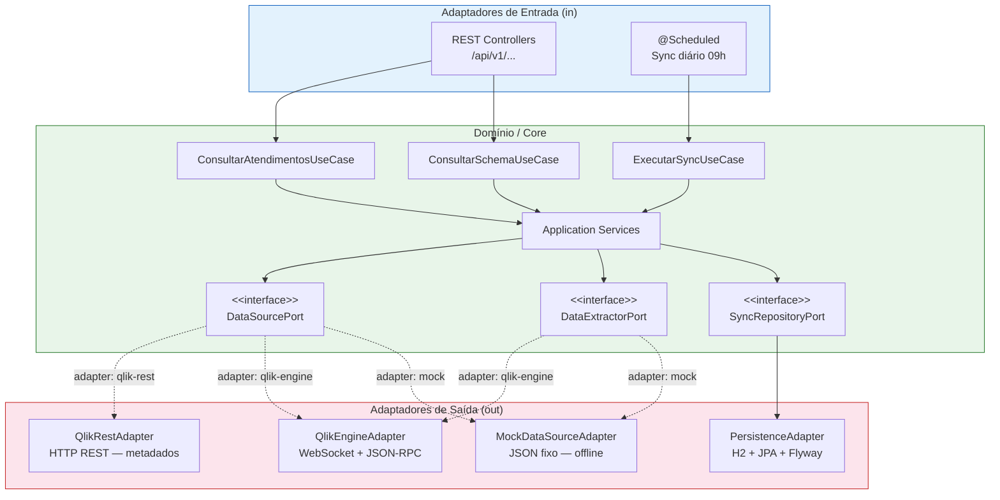

# resumo-dados-ssd

> ETL e API REST para extração, armazenamento e consulta dos dados do  
> **Núcleo de Telessaúde** e da **Superintendência de Saúde Digital — SES/MS**

[](https://github.com/SES-MS/resumo-dados-ssd/actions/workflows/ci.yml)
[](https://openjdk.org/projects/jdk/21/)
[](https://spring.io/projects/spring-boot)
[](LICENSE)

---

## Visão Geral

Este projeto extrai os dados do painel público **Saúde Digital / Telessaúde MS**,
hospedado em [`paineispublicos.saude.ms.gov.br`](https://paineispublicos.saude.ms.gov.br/extensions/saude-digital/saude-digital.html),
e os disponibiliza via API REST própria — desacoplando a plataforma Qlik Sense
do consumo dos dados.

### Contexto institucional

| Área | Descrição |
|------|-----------|
| **Núcleo de Telessaúde MS** | Acompanha atendimentos realizados, especialidades, municípios atendidos, perfil dos pacientes e resolutividade |
| **Superintendência de Saúde Digital (SES/MS)** | Monitora cobertura do programa piloto, adesão municipal, incidentes de suporte e taxa de ocupação das vagas |

### Fonte de dados atual

O painel é alimentado pelo app Qlik Sense **"Saude Digital - FIOCRUZ"**
(`app-id: 10f9b380-d7a4-426c-ae4e-8f6b7d3bd3fb`), publicado pela SES/MS e
mantido em parceria com a FIOCRUZ. O Qlik **será substituído no futuro** por
outra API — a arquitetura do projeto foi desenhada para que essa troca não
requeira alteração no domínio ou nos serviços de negócio.

### Principais tabelas extraídas

| Tabela Qlik | Tabela H2 | Registros (ref. mar/2026) | Estratégia | Conteúdo |
|-------------|-----------|--------------------------|------------|----------|
| `DB_DIGSAUDE` | `atendimento` | 16.426 | Incremental | Atendimentos realizados |
| `LINK` | `link` | 22.325 | Truncate-reload | Ligação atendimentos × jornadas × profissionais |
| `TEMPDB_USER` | `profissional` | 9.213 | Incremental | Profissionais / usuários |
| `USERJORNADA` | `jornada_vagas` | 5.310 | Truncate-reload | Jornadas e vagas ofertadas |
| `MUN_PILOTO` | `municipio_piloto` | 68 | Truncate-reload | Municípios no programa piloto |
| `MUN_SEMATIVIDADE` | `municipio_sem_atividade` | 68 | Truncate-reload | Municípios sem atividade registrada |
| `MUNAPROV_PILOTO` | `munaprov_piloto` | 207 | Truncate-reload | Municípios aprovados no programa piloto |
| `MAPS_OFF` | `maps_off` | 79 | Truncate-reload | Dados geográficos para mapa offline |

> **Notas de mapeamento de campos:**
> - `LINK.CHAVE` retorna sempre nulo no Qlik — a chave natural usada é `ID_DIGSAUDE_REF` (chave composta, ex: `14_fev_2025_DEODÁPOLIS`)
> - `USERJORNADA.MES_VAGAS` é texto (ex: `"fev"`) — o campo numérico é `MES_NUM_VAGAS`
> - `USERJORNADA.ID_USER` não existe — o campo correto é `ID_USER_JORND`
> - `MUN_PILOTO` não possui campo `COD_IBGE` — a coluna correspondente em `municipio_piloto` fica nula intencionalmente

---

## Arquitetura

O projeto segue a **Arquitetura Hexagonal (Ports & Adapters)** com princípios SOLID,
de forma que a fonte de dados (atualmente Qlik Sense) é completamente intercambiável
por configuração YAML — sem alterar domínio, serviços ou endpoints.



### Estrutura de pacotes

```
br.gov.ms.saude.ssd/
├── domain/                        # Regras de negócio puras — zero frameworks
│   ├── model/                     # Entidades e value objects agnósticos de plataforma
│   │   ├── AppMetadata            # Metadados da fonte (id, nome, último reload)
│   │   ├── DataSchema             # Schema completo: List<TableSchema>
│   │   ├── TableSchema            # nome, totalRegistros, List<FieldSchema>
│   │   ├── FieldSchema            # nome, tipo, cardinalidade, isPrimaryKey
│   │   ├── ObjectDescriptor       # id, tipo (CHART/KPI/FILTER), título
│   │   ├── ObjectData             # objectId, headers, rows
│   │   ├── QueryOptions           # filters, pagination, sortBy
│   │   └── HealthStatus           # UP / DOWN / DEGRADED, latencyMs
│   ├── port/
│   │   ├── in/                    # Portas de entrada (use cases — interfaces)
│   │   └── out/                   # Portas de saída (DataSourcePort, SyncPort...)
│   └── exception/                 # Exceções de domínio (sem dependência de HTTP)
├── application/
│   └── service/                   # Implementa as portas de entrada — orquestra o domínio
├── adapter/
│   ├── in/
│   │   ├── rest/                  # Controllers REST + DTOs de resposta
│   │   └── scheduler/             # @Scheduled — dispara sync incremental
│   └── out/
│       ├── qlik/
│       │   ├── rest/              # QlikRestAdapter (HTTP REST — Fase 1)
│       │   └── engine/            # QlikEngineAdapter (WebSocket — Fase 2)
│       ├── mock/                  # MockDataSourceAdapter (desenvolvimento offline)
│       └── persistence/           # JPA Repositories, entidades de BD, Flyway migrations
└── config/                        # Beans Spring, configuração de segurança, Swagger
```

> **SOLID aplicado:**
> - **S** — cada classe tem uma única responsabilidade
> - **O** — novos adaptadores não modificam o domínio (extensão sem modificação)
> - **L** — qualquer `DataSourcePort` substitui outro sem quebrar os serviços (contract tests garantem isso)
> - **I** — interfaces segregadas: `DataSourcePort` != `DataExtractorPort` != `SyncRepositoryPort`
> - **D** — o domínio depende de abstrações (interfaces), nunca de implementações concretas

---

## Pré-requisitos

| Requisito | Versão mínima | Observação |
|-----------|--------------|------------|
| Java (JDK) | 21 | OpenJDK ou Eclipse Temurin recomendados |
| Git | qualquer | Para clonar o repositório |
| Maven | — | **Não é necessário instalar** — use o Maven Wrapper (`./mvnw`) incluso |

> O projeto inclui o **Maven Wrapper** (`.mvn/wrapper/`). Todos os comandos
> desta documentação usam `./mvnw` (Linux/macOS) ou `mvnw.cmd` (Windows).
> Não é preciso ter Maven instalado globalmente.

---

## Como Executar Localmente

### 1. Clonar o repositório

```bash
git clone https://github.com/SES-MS/resumo-dados-ssd.git
cd resumo-dados-ssd
```

### 2. Escolher o profile e executar

O projeto oferece três profiles de execução:

#### Profile `dev` — conecta ao Qlik Sense (requer acesso à rede SES/MS)

```bash
./mvnw spring-boot:run -Dspring-boot.run.profiles=dev
```

Configuração em `src/main/resources/application-dev.yml`:
```yaml
datasource:
  adapter: qlik-engine        # WebSocket — dados reais
  qlik:
    host: paineispublicos.saude.ms.gov.br
    app-id: 10f9b380-d7a4-426c-ae4e-8f6b7d3bd3fb
    ws-timeout-ms: 30000
    page-size: 5000
```

#### Profile `test` — usa MockAdapter (totalmente offline, sem Qlik)

```bash
./mvnw spring-boot:run -Dspring-boot.run.profiles=test
```

Ideal para desenvolvimento local sem acesso à rede institucional.
Os dados vêm de `src/test/resources/mock-data/`.

#### Profile `prod` — configuração de produção

```bash
# Em produção, as variáveis sensíveis vêm de application-secrets.yml
# ou de variáveis de ambiente (application-secrets.yml está no .gitignore)
./mvnw spring-boot:run -Dspring-boot.run.profiles=prod
```

> `application-prod.yml` e `application-secrets.yml` estão no `.gitignore`
> e **nunca devem ser versionados**.

### 3. Acessar a aplicação

Após iniciar, acesse:

| Recurso | URL |
|---------|-----|
| API REST | `http://localhost:8080/api/v1/` |
| Swagger UI | `http://localhost:8080/swagger-ui.html` |
| Console H2 | `http://localhost:8080/h2-console` (apenas em `dev` e `test`) |
| Actuator Health | `http://localhost:8080/actuator/health` |

O banco H2 é armazenado em `./data/ssd-db.mv.db` (diretório `data/` está no `.gitignore`).

---

## Endpoints da API REST

| Método | Endpoint | Descrição |
|--------|----------|-----------|
| `GET` | `/api/v1/atendimentos` | Lista paginada com filtros (município, período, especialidade) |
| `GET` | `/api/v1/atendimentos/{id}` | Atendimento por ID |
| `GET` | `/api/v1/atendimentos/resumo` | KPIs: total, por município, por especialidade |
| `GET` | `/api/v1/profissionais` | Lista de profissionais ativos |
| `GET` | `/api/v1/vagas` | Vagas ofertadas por período e especialidade |
| `GET` | `/api/v1/municipios` | Municípios atendidos com status no programa piloto |
| `GET` | `/api/v1/incidentes` | Incidentes de suporte técnico |
| `GET` | `/api/v1/schema` | Schema das tabelas extraídas da fonte |
| `GET` | `/api/v1/health` | Saúde da conexão com a fonte de dados |
| `GET` | `/api/v1/sync/status` | Status da última sincronização das tabelas principais |
| `GET` | `/api/v1/sync/history/{tabela}` | Histórico de sync de uma tabela (ex: `link`, `atendimento`) |
| `POST` | `/api/v1/sync/trigger` | Dispara sincronização manual (`?tipo=full` ou `?tipo=incremental`) |

Documentação interativa completa disponível em `/swagger-ui.html` após iniciar a aplicação.

### Parâmetros de filtro (GET /api/v1/atendimentos)

| Parâmetro | Tipo | Exemplo | Descrição |
|-----------|------|---------|-----------|
| `municipio` | string | `Campo Grande` | Nome do município |
| `especialidade` | string | `Cardiologia` | Nome da especialidade |
| `dataInicio` | date | `2025-01-01` | Início do período (ISO 8601) |
| `dataFim` | date | `2026-03-31` | Fim do período (ISO 8601) |
| `status` | enum | `REALIZADO` | Status da consulta |
| `page` | int | `0` | Página (zero-based) |
| `size` | int | `20` | Registros por página (máx. 100) |

---

## Como Trocar o Adaptador de Fonte de Dados

A troca do Qlik por qualquer outra API requer apenas **uma linha de configuração**
no `application.yml` do environment desejado — zero alteração no domínio ou nos serviços.

```yaml
# Qlik REST (metadados públicos — Fase 1)
datasource:
  adapter: qlik-rest

# Qlik Engine API via WebSocket (dados completos — Fase 2)
datasource:
  adapter: qlik-engine

# Mock offline (desenvolvimento e testes)
datasource:
  adapter: mock

# Futuro substituto do Qlik
datasource:
  adapter: nova-api   # basta criar o adaptador (ver seção abaixo)
```

O Spring Boot ativa automaticamente o adaptador correto via
`@ConditionalOnProperty(name = "datasource.adapter", havingValue = "...")`.

---

## Como Adicionar um Novo Adaptador

Quando o Qlik for substituído por outra API, siga estes três passos:

### Passo 1 — Implementar a interface `DataSourcePort`

```java
/**
 * Adaptador para a nova API de dados da SES/MS.
 *
 * <p>Ativação: {@code datasource.adapter=nova-api} no application.yml</p>
 *
 * @see DataSourcePort
 */
@Component("novaApiAdapter")
@ConditionalOnProperty(name = "datasource.adapter", havingValue = "nova-api")
public class NovaApiAdapter implements DataSourcePort, DataExtractorPort {

    @Override
    public AppMetadata getAppMetadata() { /* implementação */ }

    @Override
    public DataSchema getDataSchema() { /* implementação */ }

    @Override
    public ObjectData getObjectData(String objectId, QueryOptions options) { /* implementação */ }

    @Override
    public List<ObjectDescriptor> listAvailableObjects() { /* implementação */ }

    @Override
    public HealthStatus checkHealth() { /* implementação */ }
}
```

### Passo 2 — Estender o Contract Test

```java
/**
 * Garante que NovaApiAdapter cumpre o contrato de DataSourcePort.
 * Se todos os testes passarem, o adaptador pode substituir qualquer outro.
 */
class NovaApiAdapterContractTest extends DataSourcePortContractTest {

    @Override
    protected DataSourcePort createAdapter() {
        // configure WireMock ou stub para simular a nova API
        return new NovaApiAdapter(configuracaoDeTeste());
    }
}
```

### Passo 3 — Configurar o YAML

```yaml
# application-prod.yml
datasource:
  adapter: nova-api
  nova-api:
    base-url: https://api.saude.ms.gov.br
    token: ${NOVA_API_TOKEN}   # variável de ambiente
```

> Nenhuma alteração é necessária no domínio, nos serviços, no ETL ou nos endpoints REST.
> Os contract tests garantem (via Princípio de Liskov) que o novo adaptador
> se comporta exatamente como os anteriores.

---

## Como Executar os Testes

### Todos os testes

```bash
./mvnw clean verify
```

### Apenas testes unitários

```bash
./mvnw test
```

### Contract tests (profile específico)

```bash
./mvnw test -Pcontract
```

Os contract tests validam que **todos os adaptadores** implementam `DataSourcePort`
de forma equivalente. Se um adaptador falha aqui, ele não pode entrar em produção.

### Testes de arquitetura (ArchUnit)

```bash
./mvnw test -pl . -Dtest="*ArchitectureTest"
```

Valida regras SOLID: o domínio não pode depender de adaptadores, controllers não
acessam repositórios diretamente, adaptadores não se conhecem entre si.

### Relatório de cobertura (JaCoCo)

```bash
./mvnw verify
# relatório gerado em: target/site/jacoco/index.html
```

### Estratégia de testes por camada

| Tipo | Ferramenta | O que valida |
|------|-----------|-------------|
| Contract Tests | JUnit 5 (classe abstrata) | Comportamento equivalente entre todos os adaptadores |
| Unit Tests | JUnit 5 + Mockito | Lógica interna de cada classe isoladamente |
| Integration Tests | WireMock + H2 | Fluxo ponta a ponta sem dependência de serviços externos |
| API Tests | MockMvc | Endpoints REST (request/response, paginação, filtros) |
| Architecture Tests | ArchUnit | Violações SOLID e dependências proibidas entre camadas |

---

## Contribuindo

Leia o [CONTRIBUTING.md](CONTRIBUTING.md) antes de abrir um Pull Request.

O projeto segue **Conventional Commits**, usa o fluxo de branches
`main / develop / feature/* / hotfix/*` e exige que todos os testes
(incluindo contract tests e testes de arquitetura) passem no CI antes do merge.

---

## Licença

Distribuído sob a licença [Apache 2.0](LICENSE).  
Desenvolvido pela **Superintendência de Saúde Digital — SES/MS**.
